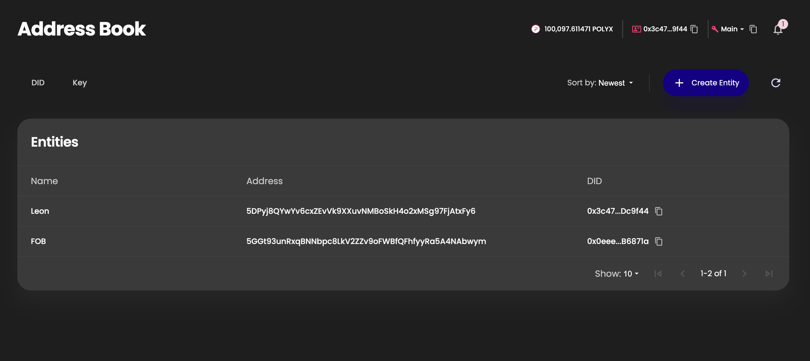
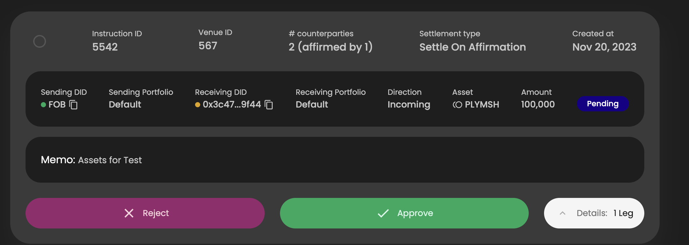

# Polymesh Association Grant Proposal

- **Project Name:** Address Book
- **Team Name:** Leon Prouger
- **Payment Address:** 5DPyj8QYwYv6cxZEvVk9XXuvNMBoSkH4o2xMSg97FjAtxFy6
- **Level:** 1

## Project Overview :page_facing_up:

### Overview

The project introduces an address book to the Polymesh portal, allowing users to assign name tags to DID and keys. This addition aims to enhance the overall user experience of the portal, making it easy to perform and oversee transactions with the help of the address book.

### Project Details

### Address Book Page

When accessing the address book page, the user is presented with a table under two tabs, displaying address book entities for DIDs and keys. This table shows an association between each DID/key and the user-defined name tag. Users can add, remove, edit items within the address book (CRUD operations are supported). Users can conveniently search and sort entries, with options to export and import items in CSV format. The address book entities are stored in local the storage, ensuring they are accessible only within the user's browser environment."

The address book will have two entry types - DID and key, displayed in two separated tables. Each table contains the following fields:

**DID table fields**
- User assigned name
- DID with a coppy button
- primary key address with a link to Polymesh blockchain explorer
- Actions buttons for edit and remove 

**Keys table fiels**
- User assigned name
- Key address with a link to Polymesh Subscan blockchain explorer
- Label for the key type - unassigned, multisig, multisig signer, smart contract, primary key, secondary key
- The DID associates with the key with a coppy button
- Action buttons for edit and remove 

**UI specifications**
- The address book will have a dedicated page that got two table under diffrent tabs - DID and keys
- The address book modal will be used for adding and editing entities
- The address book page will integrate with the existing Portal design and style.
- There will be a dedicated menu/sidebar option for the address book.
- The address book will be reactive, so it works with both desktop and mobile layouts.
- The address book will support both Light and Dark themes.

#### Name tag display

Address book entities will be integrated into the existing pages of the portal. Whenever a DID or key is displayed, the corresponding name tag will be shown next to it. Furthermore, when a DID or key is required to be entered, the user can simply use the name tag. A filter dropdown menu will be presented to the user, allowing the selection of the associated key/DID by choosing a name tag. For example:
- When sending POLYX, it should be possible to select a key from the address book as a destination.
- When creating a settlement instruction, it should be possible to select a DID from the address book as a destination.
- When adding authorizations, it shall be possible to select a key or DID, as required, from the address book.
- When adding claims, it shall be possible to select a key or DID, as required, from the address book.

* *The mocks are for presentation purposes only and do not represent the final version.*

### Ecosystem Fit

Address book enhace the user experience of the polymesh portal.

## Team :busts_in_silhouette:

### Team members

### Contact

- **Contact Name:** Leon Prouger
- **Contact Email:** leonprou@gmail.com
- **Website:** https://github.com/leonprou

### Legal Structure

- **Registered Address:** 
- **Registered Legal Entity:**

### Team's experience

I have 10 years of engineering experience - JS, TS, Python, Rust. And 5 years working with blockchain - Solidity, EVM, Web3. I led the development of Fuse Network, and its Wallet as a service platform. I also was involed in the release of https://safe.fuse.io/.

### Team Code Repos

Provide the address of the github org and repos where the completed project will be hosted
- https://github.com/leonprou
- https://github.com/leonprou/polymesh-portal

Please also provide the GitHub accounts of all team members. If they contain no activity, references to projects hosted elsewhere or live are also fine.

- https://github.com/leonprou

### Team LinkedIn Profiles (if available)

- https://www.linkedin.com/in/leon-prouger-60646540/

## Development Status :open_book:

PoC version was developed, in the PoC hard coded data is used.

## Development Roadmap :nut_and_bolt:

### Overview

- **Total Estimated Duration:** 2 month
- **Full-Time Equivalent (FTE):** 0.65
- **Total Costs:** 7,500 USD

### Milestone 1 — Implement Address Book

- **Estimated duration:** 2 month
- **FTE:** 0.65
- **Costs:** 7,500 USD

| Number | Deliverable | Specification |
| -----: | ----------- | ------------- |
| 0.a  | Specification | Product and technical specification of the overall feature
| 0.b | PoC | PoC in a defined scope to prove the feasibility and understand the codebase
| 1. | Feature: Address book table | Address book table that allows CRUD for address book entities
| 1. | Feature: Additional table features | Searching and sorting entity records
| 2. | Feature: Import and Export | Importing and exporing entity book data, CSV support.
| 3. | Feature: Name tag display | Displaying the name tag in addition to the DID.
| 4. | Support | Feature support and bug fixing during Q1 of 2024.

## Future Plans

In the future the account key functionality in the address book can be improve:
- displaying seconday keys that are related to the DID in form of `leon.secondary`
- special handling for adding keys that associated with DID address book entities

*Note:The suggestions can be included in the proposal as the second milestone.*

## Additional Information :heavy_plus_sign:

**How did you hear about the Grants Program?** personal recommendation.

I gained familiarity with the codebase through the execution of a time-bound PoC. This exercise was pivotal in assessing the proposal's feasibility and in comprehending the full extent of the work required